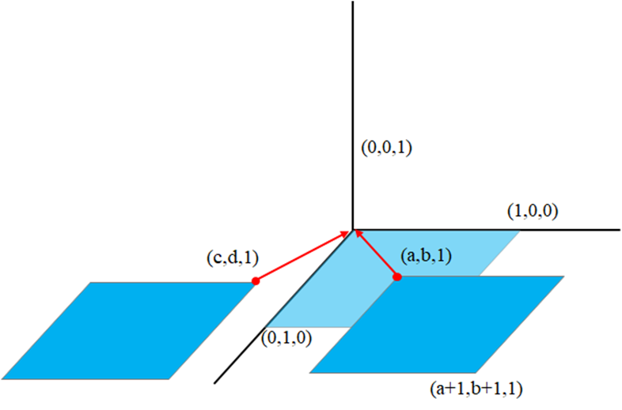

# 동차좌표계와 원근 투영 발표 자료

## 동차좌표계란
- 사영기하학에서 동차좌표는 n차원 사영 공간을 n+1개의 좌표로 나타내는 좌표계다.

- (x,y)를 (x,y,1)로 표현하는 것을 말합니다.

- 일반적으로 말해 임의 0이 아닌 상수 W에 대해 (x,y)를 (wx,wy, w)로 표현하는 것 입니다.

- 동차 좌표계를 사용하면 affine변환이나 perspective변환을 하나의 단일 행렬로 표현 할 수 있습니다.

- Projective geometry 에서 사용하는 좌표계가 동차 좌표이며 다른말로 projective좌표 라고 합니다

## 동차좌표의 표현

실제로 OpenGL과 같은 그래픽 라이브러리에서 4x4의 3차원 좌표행렬을 4개의 수로 줄여서 표현합니다.

예를 들어 (x, y, z, w)로 표현되며 각각 x, y, z 좌표와 점인지 선인지 표현하는 w로 이루어진 동차좌표를 사용합니다.
 

- 3차원 점: (x, y, z, 1) 
- 3차원 벡터: (x, y, z, 0)
- 점은 w가 1이고, 벡터는 w가 0

- 아핀 공간에서 이동 변환된 공간의 원점의 정체가 점(point)이라고 언급하였다. 

- 위의 그림은 점 (a,b)와 점 (c,d)를 나타내고 있다.
 
- 아핀 공간에서 점이 되려면 z 값은 1이어야 한다.

세 번째 요소인 z 값이 점점 줄어든다면? 

밀기 변환의 개념으로 생각해보았을 때 z 값이 점점 줄어들면 각 점은 아핀 공간에서 벗어나 빨간 화살표의 방향으로 이동하면서 결국 원점에서 만나게 될 것이다.

점의 이동 궤적을 선이라고 한다면 두 선이 한 점에서 모이는 모습이 만들어진다. 

주제는 무한대 개념이 들어간 사영 기하학이다. 무한대 개념을 사용해 점의 수렴을 표현하려면 어떻게 할 것인가??

가장 손쉬운 방법은 마지막 요소인  w값으로 나누는 방법을 생각할 수 있다. (여기서 w는 가중치를 나타냅니다.)

- (x, y, z, w)좌표를 (x/w, y/w, z/w, 1)의 형태로 바꾸는 것이다.
 w가 1이라면 x와 y는 점의 원래 값을 유지한다. 
 w가 0으로 작아질수록 x와 y의 값은 무한대로 커진다.   
이렇게 아핀 공간에 기여하지 않는 마지막 요소인 w를 무한대 요소로 사용해 x와 y를 나누어 표시하는 좌표계를 동차 좌표계 라고 한다.

## 동차 좌표를 사용하는 이유와 결론
동차좌표를 사용하는 이유는 시점으로 부터의 방향이 중요하기 때문입니다.

즉 OpenGL에서 표현되는 공간은 우리 눈에 보이지 않더라도 앞과 뒤의 구분이 있다는 점입니다.

따라서 점과 백터의 구분이 필요합니다.

동차 좌표계 덕분에 오브젝트의 이동을 행렬간의 곱셈으로 표현할 수 있습니다.

컴퓨터 그래픽스에서 동차좌표의 마지막 요소를 Scale Factor로 사용할 수 있으며, 만약 어떤 점의 좌표를 (x, y, z, w) 로 표현했다면 

실제 3차원 좌표의 값은 (x/w, y/w, z/w)로 될 수 있습니다.

## Perspective Projection (원근 투영)

물체를 화면에 투영할 때 원근적으로 투영하는 방법

실제 시각과 유사한 원근 효과를 제공하여 깊이와 거리에 따라 물체의 크기와 위치가 변화

물체의 크기와 각도는 시점에 따라 변화

- l = left
- t = top
- b = bottom
- r = right

## Perspective Projection matrix(원근 투영 행렬)

